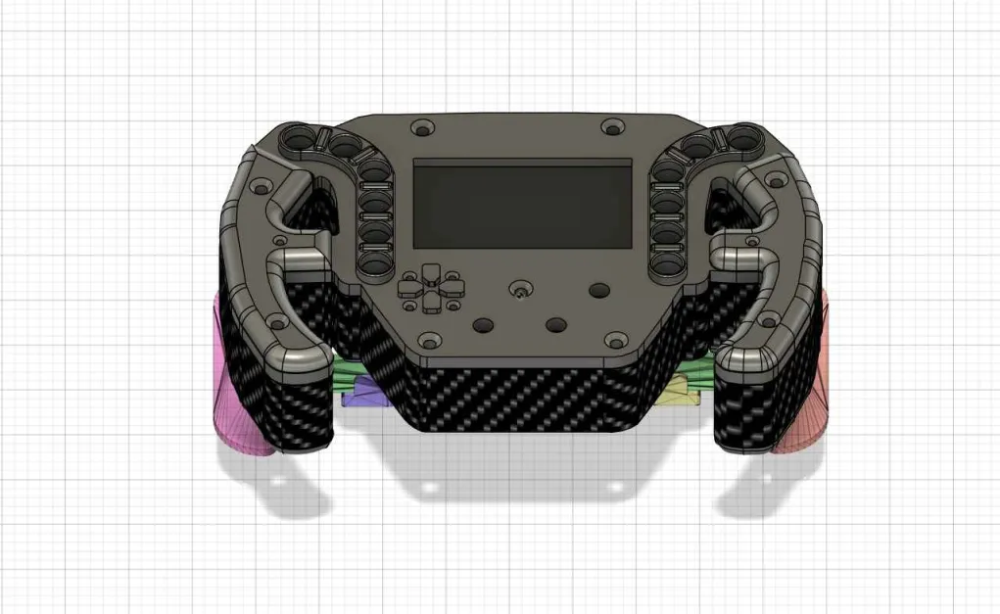

# Volante FFB Caseiro


> Este projeto tem como objetivo construir um simulador de corrida profissional de forma caseira. 

## Descrição do Projeto

Torque: 20nm
Força no pedal de freio: 80kg (será aumentada para 150kg)
Peso total: 3kg
Resolução do Encoder: 600 P/R (Pulsos por Rotação)
Volante: Volante caseiro impresso em 3D, inspirado no design dos volantes dos hypercarros da Porsche Penske.

## Volante Porsche Penske



Este volante foi modelado com base no volante dos hypercars da Porsche Penske, equipe de corridas de endurance (WEC).
Tudo foi impresso em 3D usando filamento PLA em uma impressora Creality Ender V3

## ☕ Usando <nome_do_projeto>

Para usar <nome_do_projeto>, siga estas etapas:

```
<exemplo_de_uso>
```

Adicione comandos de execução e exemplos que você acha que os usuários acharão úteis. Fornece uma referência de opções para pontos de bônus!

## 📫 Contribuindo para <nome_do_projeto>

Para contribuir com <nome_do_projeto>, siga estas etapas:

1. Bifurque este repositório.
2. Crie um branch: `git checkout -b <nome_branch>`.
3. Faça suas alterações e confirme-as: `git commit -m '<mensagem_commit>'`
4. Envie para o branch original: `git push origin <nome_do_projeto> / <local>`
5. Crie a solicitação de pull.

Como alternativa, consulte a documentação do GitHub em [como criar uma solicitação pull](https://help.github.com/en/github/collaborating-with-issues-and-pull-requests/creating-a-pull-request).

## 😄 Encomende o seu!

Quer ter um volante customizado para o seu simulador, ou adquirir um simulador? Me manda uma mensagem no [Instagram](www.instagram.com/adrianob.13)

## 📝 Licença

Esse projeto está sob licença. Veja o arquivo [LICENÇA](LICENSE.md) para mais detalhes.
